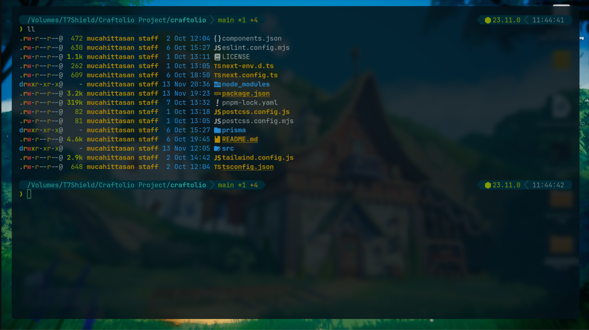
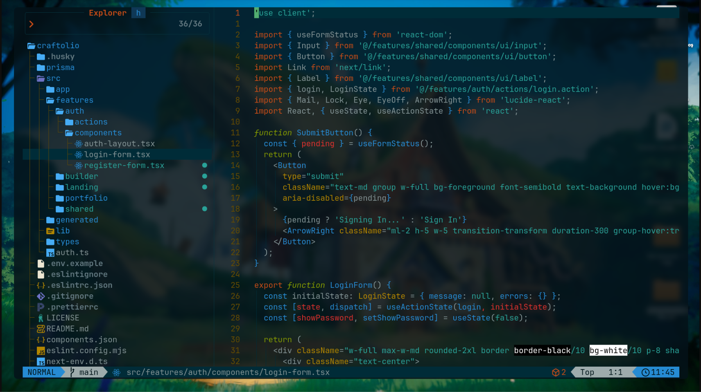
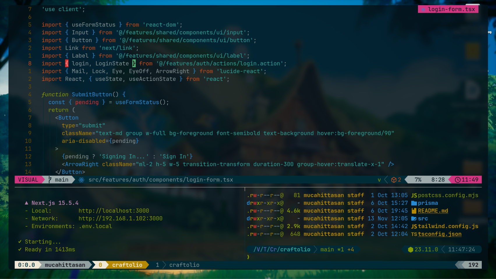

### WezTerm Setup



### Neovim Dashboard



### Tmux Workspace



# Mucahit’s Dotfiles

> ⚠️ **Disclaimer:** These configurations are optimized for my workflow.  
> Don’t blindly copy them unless you know what you’re doing.  
> Use at your own risk.

---

## 🌐 About

This repository contains my complete development environment setup on macOS — fully keyboard-driven, minimal, and performance-focused.  
I use a terminal-first workflow powered by **WezTerm + tmux + Neovim**, designed for speed and flow.

If you’re transitioning from conventional IDEs to a modern command-line workflow, this repo may give you some ideas.

---

## 📦 Contents

- **Neovim configuration** — Lua-based, built on LazyVim.
- **Tmux configuration** — Custom status bar, session/window helpers.
- **Fish shell setup** — Fast, modern shell environment.
- **WezTerm configuration** — Solarized Osaka theme, blur, transparency.
- **Git configuration** — Commitizen, aliases, workflow optimizations.
- **Zsh configuration** — Lightweight alternative shell setup.
- **Utility scripts** — Helper scripts for automation.

---

## 🧩 Tools & Technologies

### 🔹 Terminal & UI

- WezTerm (macOS/Linux/Windows)
- tmux
- Nerd Font (JetBrainsMono NF / PlemolJP)
- Solarized Osaka theme

### 🔹 Shell (macOS & Linux)

- Fish shell
- Fisher — plugin manager
- Tide — shell prompt
- z — directory jumping
- eza — modern `ls`
- fzf — fuzzy finder
- ghq — repo organizer

### 🔹 Neovim

- Neovim >= 0.9.0
- LazyVim
- Treesitter (requires C compiler)
- Telescope
- lazygit (optional)
- ripgrep — live grep
- fd — file finder

### 🔹 Git

- Git >= 2.19.0 (for partial clone support)
- Commitizen / Commitlint workflow (optional)

---

## 🚀 Setup (Symlink Workflow)

All config files live inside:

```
~/dotfiles
```

I manage everything using symlinks so that editing configs allows instant version-controlled updates.

### Example

```sh
git clone https://github.com/mucahittasan/dotfile-mucahit ~/dotfiles

# Symlink your configs
ln -s ~/dotfiles/.config ~/.config
ln -s ~/dotfiles/.gitconfig ~/.gitconfig
ln -s ~/dotfiles/.zshrc ~/.zshrc
```

Modify things inside `~/dotfiles` → and they automatically apply system-wide.

<!-- --- -->
<!---->
<!-- ## 🎥 Tutorials (Coming Soon) -->
<!---->
<!-- Planned videos & guides: -->
<!---->
<!-- - My full Neovim setup -->
<!-- - Terminal workflow: WezTerm + Fish + Tmux -->
<!-- - Productive Git workflow for frontend developers -->
<!-- - How I structure and manage my dotfiles -->
<!-- - Designing a distraction-free terminal environment -->
<!---->
<!-- Follow my socials for updates 👀 -->

<!-- --- -->
<!---->
<!-- ## 🧑‍💻 About Me -->
<!---->
<!-- - Frontend Developer (Next.js, TypeScript, SSR) -->
<!-- - Terminal-first workflow enthusiast -->
<!-- - Focused on clean UI/UX and developer productivity -->
<!-- - I enjoy “calm vibes” coding & ASMR-style setups ☕✨ -->
<!---->
<!-- **X:** @mucahittasan   -->
<!-- **YouTube:** Devtasan   -->
<!-- **Main Project:** Craftolio — AI-powered mini website generator -->
<!---->
<!-- --- -->

## ⭐ Support

If you find this repo useful or inspiring, feel free to **star the project**.  
It helps visibility and motivates me to keep improving it.

---

## 📁 Example Folder Structure

```txt
dotfiles/
├── .config/
│   ├── nvim/
│   ├── wezterm/
│   ├── fish/
│   ├── tmux/
│   └── starship/
├── scripts/
├── .gitconfig
├── .zshrc
└── README.md
```
